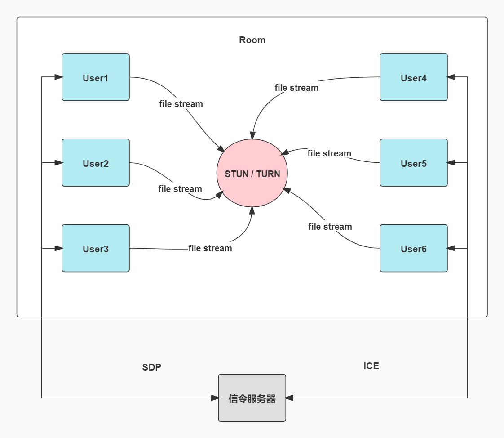

# tl-rtc-file-tool   【始于文件传输，不止于文件传输】

#### 背景 ： 20年毕设的题目相关整理出来的

#### 简介 ：（tl webrtc datachannel filetools）用webrt在web端传输文件，支持传输超大文件。

#### 优点 ： 分片传输，跨终端，不限平台，方便使用，内网不限速，支持私有部署，支持多文件拖拽发送

#### 扩展 ： 扩展了许多丰富的小功能，如本地屏幕录制，远程屏幕共享，远程音视频通话，直播，取件码，密码房间，中继服务设置，webrtc检测，文字传输，公共聊天，丰富的后台管理，集成了企微机器人告警通知，实时执行日志展示... 等等

#### 说明 ： 示例网站是在公网环境中，为了更好的展示传输功能，所以默认开启了中继服务，如果各位是验证能否走p2p传输，只需关闭中继服务，且p2p检测后，如果能看到内网环境ip，webrtc连接大概率可以走p2p，公网环境下的内网用户一般情况下来说也会自动识别到的，如果内网速度慢，可以反馈留言，会尽快优化处理

#### 体验 ： https://im.iamtsm.cn/file

**qq交流群 : 624214498**

## 准备 (必须步骤)

安装node-14.x或14.x以上，npm后进入项目目录运行下面命令

    `cd svr/`

    `npm install`

    首次运行/自行开发页面，需要启动下面两个命令之一

    `npm run build:dev` (打包监听文件改动打包min) 或者  `npm run build:pro` 打包min

## 启动 (必须步骤)

http形式启动以下两个服务, 选一种模式启动即可

    api服务: `npm run lapi`

    socket服务 : `npm run lsocket`

或者https形式启动一下两个服务

    api服务: `npm run sapi`

    socket服务 : `npm run ssocket`

## 配置websocket (必须步骤)

修改cfg.json中相应ws配置，或者wss配置

    "ws": {
          "port": 8444,                         #socket 端口
          "host": "ws://127.0.0.1:8444",        #socket ip
     },
     "wss" : {
          "port": 8444,
          "host": "wss://域名||ip:port",
     },

## 配置数据库 (非必须步骤)

修改cfg.json中相应数据库配置  

    "db": {
        "open": false, #是否开启数据库, 默认关闭
        "mysql": {
            "host": "host地址",
            "port": 3306,
            "dbName": "数据库名称",
            "user": "用户名",
            "password": "密码",
            "other": {
                "sequelize": {
                    "dialect": "mysql",
                    "host": "host地址",
                    "port": 3306,
                    "logging": false,
                    "pool": {
                        "max": 5,
                        "min": 0,
                        "acquire": 30000,
                        "idle": 10000
                    },
                    "timezone": "+08:00",
                    "define": {
                        "freezeTableName": true,
                        "underscored": true,
                        "charset": "utf8",
                        "collate": "utf8_general_ci",
                        "timestamps": false,
                        "paranoid": true
                    }
                }
            }
        }
    }

## 配置turnserver (局域网非必须步骤，公网必须步骤)

ubuntu示例:

    安装coturn  `sudo apt-get install coturn`

    项目提供了一份配置文件模板在 : `conf/turn/turnserver.conf`

    修改配置文件后复制一份  `cp conf/turn/turnserver.conf /etc/turnserver.conf`

示例用户和密码: tlrtcfile

    生成用户 (turnadmin生成密码)  `turnadmin -k -u tlrtcfile -r 你的域名`
    或者 (自定义密码)  `turnadmin -a -u tlrtcfile -p tlrtcfile -r 你的域名`
    启动turnserver  `turnserver -c /etc/turnserver.conf`

    可参考示例模板 : `bin/turnStart.sh`

## Docker (非必须步骤)

    按需配置conf.json中的ws, 或者wss (需要填容器的ip，端口信息)

    docker build -t tl-open-source/tl-rtc-file .

    docker run -p 9092:9092 -p 8444:8444 --name tl-rtc-file-local -d tl-open-source/tl-rtc-file

    访问 : http://localhost:9092 或者 http://本机ip:9092

## 管理后台 (非必须步骤)

前提 ： 需要开启数据库配置

修改cfg.json中的manage的room和password，默认房间号和密码都是tlrtcfile

    访问 : http://localhost:9092 或者 http://本机ip:9092

    输入配置的房间号，输入密码，即可进入管理后台

    "manage": {
		"room": "tlrtcfile",
		"password": "tlrtcfile"
	},

## 企微通知 (非必须步骤)

修改cfg.json中的notify的qiwei数组，填入企业微信机器人的key即可

normal : 正常通知, error : 系统报错通知

    "notify": {
        "open": true,  #是否开启企业微信通知
        "qiwei": {
            "normal" : [
                "key1",
                "key2"
            ],
            "error" : [
                "key3",
                "key4"
            ]
        }
    },

## OSS云存储 (非必须步骤)

修改cfg.json中的oss

    "oss": {
		"seafile": {
			"repoid": "",
			"host": "",
			"username": "帐号",
			"password": "密码"
		},
		"alyun": {
			"AccessKey": "",
			"SecretKey": "",
			"bucket": "tl-rtc-file"
		},
		"txyun": {
			"AccessKey": "",
			"SecretKey": "",
			"bucket": "tl-rtc-file"
		},
		"qiniuyun": {
			"AccessKey": "",
			"SecretKey": "",
			"bucket": "tl-rtc-file"
		}
	},

## Chat-GPT (非必须步骤)

修改cfg.json中的openai.apiKeys，填写你自己openai账号生成的apiKey

    "openai": {
		"apiKeys": [
			
		]
	},

## 概述图

## License

### MIT License Copyright (c) 2022 iamtsm

## 免责声明

[免责声明](DISCLAIMER.md)